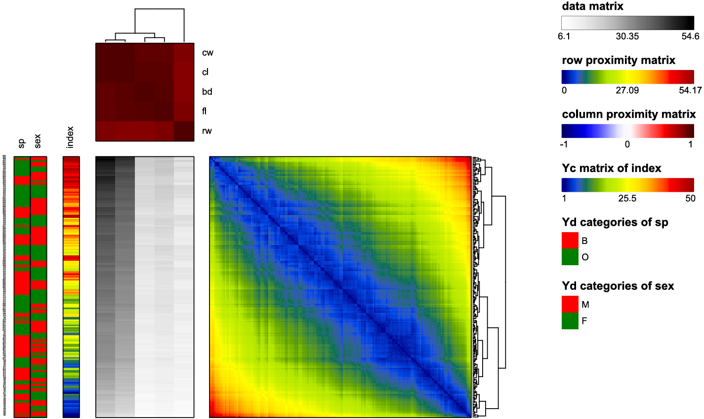

# GAPR

[](https://cran.r-project.org/web/packages/GAPR/index.html) 

GAPR is an R package implementing the generalized association plots (GAP) framework for exploratory data analysis (EDA). It combines efficient proximity computation, hierarchical clustering tree (HCT) and rank-2 ellipse (R2E) seriation, and tree-based flipping with an integrated visualization layout to reveal structural patterns in reordered data matrices. Core algorithms are optimized in C++ to ensure robust and efficient performance within the R ecosystem.

## Installation

```r
install.packages("GAPR")

# latest development version (only if newer available)
devtools::install_github("shuyyu/GAPR")
```

## Usage

```r
library(GAPR)

# Example using the crabs dataset from the MASS package
  CRAB_result <- GAP(
    data = MASS::crabs,
    YdNum = c(1,2),        # First two columns as Y discrete covariates
    YcNum = 3,             # Third column as Y continuous covariate
    row.name = c(1,2,3),   # Use First three columns as row names
    row.prox = "euclidean",
    col.prox = "pearson",
    row.order = "average",
    col.order = "average",
    row.flip = "r2e",
    col.flip = "r2e",
    original.color = 'Greys',
    border = TRUE,
    border.width = 1,
    row.label.size = 1,
    show.plot = TRUE
  )
```


`GAP()` provides flexible visualization and output options that allow users to customize the appearance of matrix layouts and manage exported results.

These options include:
- Color settings for all matrices
- Label size settings
- Export-related options (e.g., `exp.*`)
- PNG output configuration

## Example: Wine Quality Dataset
This example demonstrates how to use **GAPR** to analyze the Wine Quality dataset.

**Dataset**

We use the Wine Quality dataset from the UCI Machine Learning Repository, which contains physicochemical measurements and quality scores for red and white wines.

- Samples: 6,497 wines
- Variables:
  - 11 physicochemical variables (normalized to [0, 1])
  - Quality score (continuous covariate, Yc; 0–10)
  - Wine type (discrete covariate, Yd; "red" or "white")
- Source: https://archive.ics.uci.edu/dataset/186/wine+quality

```r
library(GAPR)

### --- data processing--- ###
## import data
df_red <- read.csv("~path/winequality-red.csv", sep = ';', header = TRUE)
df_white <- read.csv("~path/winequality-white.csv", sep = ';', header = TRUE)

## add a new column for Yd (color)
df_red$color <- 'red'
df_white$color <- 'white'

## combine two datasets by row
df_wine <- rbind(df_red, df_white)

## rank transformation
ranked_wine <- as.data.frame(
  apply(df_wine[, 1:11], 2, function(x) rank(x, ties.method = "average"))
)
ranked_wine$quality <- df_wine$quality
ranked_wine$color <- df_wine$color

### --- customized magenta–cyan palette --- ###
magenta_cyan <- c('#ff00ff', '#00FFFF')

### --- draw GAP --- ###
wine_result <- GAP(data = ranked_wine, YdNum = 13, YcNum = 12,
                   row.prox = 'euclidean', col.prox = 'pearson',
                   row.order = 'average', col.order = 'average',
                   row.flip = 'r2e', col.flip = 'r2e',
                   original.color = 'Greys',
                   Yd.color = magenta_cyan, Yc.color = 'YlGnBu',
                   colorbar.margin = .5,
                   col.label.size = 6,
                   border = T, border.width = 1,
                   exp.row_order = T, exp.column_order = T,
                   exp.row_names = T, exp.column_names = T,
                   exp.Yd_codebook = T, exp.Yd = T, exp.Yc = T,
                   exp.originalmatrix = T,
                   exp.row_prox = T, exp.col_prox = T,
                   PNGwidth = 3600, PNGheight = 2400,
                   PNGres = 300, show.plot = T
)
```


The following options are used in this example:

- **Proximity Computation**
  - Row proximity: Euclidean distance (`row.prox = "euclidean"`) for measuring distances among wine samples
  - Column proximity: Pearson correlation (`col.prox = "pearson"`) for measurin correlations among physicochemical variables

- **Ordering and Flipping**
  - Hierarchical clustering with average linkage (`row.order = "average"`, `col.order = "average"`)
  - R2E-guided flipping for enhanced structural clarity (`row.flip = "r2e"`, `col.flip = "r2e"`)

- **Color Mapping**
  - Data matrix: sequential "Greys" color palette (grayscale palette) from RColorBrewer package (`original.color = "Greys"`)
  - Discrete covariate (wine type, Yd): custom magenta–cyan palette
  - Continuous covariate (quality score, Yc): sequential "YlGnBu" color palette from RColorBrewer package

- **Layout and Labeling**
  - Reduced column label size (`col.label.size = 6`)
  - Enabled borders for all matrices and set the width (`border = TRUE`, `border.width = 1`)
  - Adjusted the colorbar margin relative to the main visualization (`colorbar.margin = 0.5`)

- **Export Options**
  - Export reordered indices and row/column names (`exp.row_order`, `exp.column_order`, `exp.row_names`, `exp.column_names`)
  - Export reordered covariate information and codebooks (`exp.Yd`, `exp.Yc`, `exp.Yd_codebook`)
  - Export reordered data and proximity matrices (`exp.originalmatrix`, `exp.row_prox`, `exp.col_prox`)

- **High-resolution Output**
  - PNG size: 3600 × 2400 pixels
  - Resolution: 300 DPI
  - Automatic rendering enabled (`show.plot = TRUE`)

## Other Functions

In addition to the main `GAP()` function, GAPR provides several user-accessible functions that can be used for specific analysis tasks:

- **Proximity computation**:  
  `computeProximity()` computes row-wise or column-wise proximity matrices using multiple distance or similarity measures.

- **Seriation and Flipping**:  
  GAPR supports multiple seriation methods, including the R2E algorithm via `ellipse_sort()` and several variants of HCT implemented through `hctree_sort()`.

- **Evaluation metrics**:  
  `AR()`, `GAR()`, and `RGAR()` are provided to quantitatively assess the quality of ordering results based on proximity structures.

## Further Information

  For detailed function arguments, additional examples, and advanced usage options, please refer to the package documentation:

- Function-level documentation: `?GAP`, `?computeProximity`, `?ellipse_sort`, `?hctree_sort`
- Full function index: `help(package = "GAPR")`

## Publication

This work is published in *Journal of Open Research Software*:

[](https://doi.org/10.5334/jors.669)
